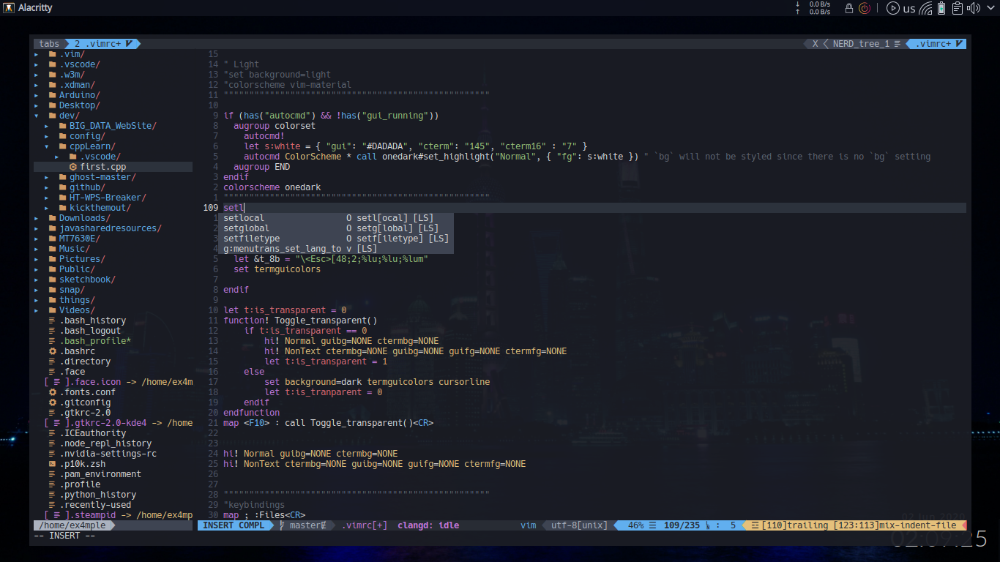
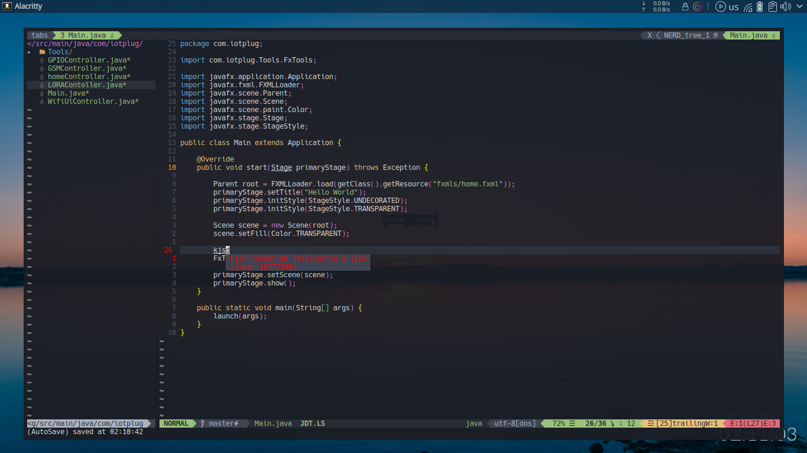

#Nvim configuration
Installing and configuring **Nvim** Text editor





### Installing nvim
Open the normal terminal and enter the following command 
```
sudo apt-get install neovim
```
### Installing all themes and plugins 
For full support of all themes and plugins node is required 
install node by runing the following command 

```
sudo apt-get install nodejs
```

Now start neovim by the command 
```
nvim 
```

type the following command to install all plugins and themes 
```
:PlugInstall
```
```
:PluginInstall
```


**And here you go** :+1:

